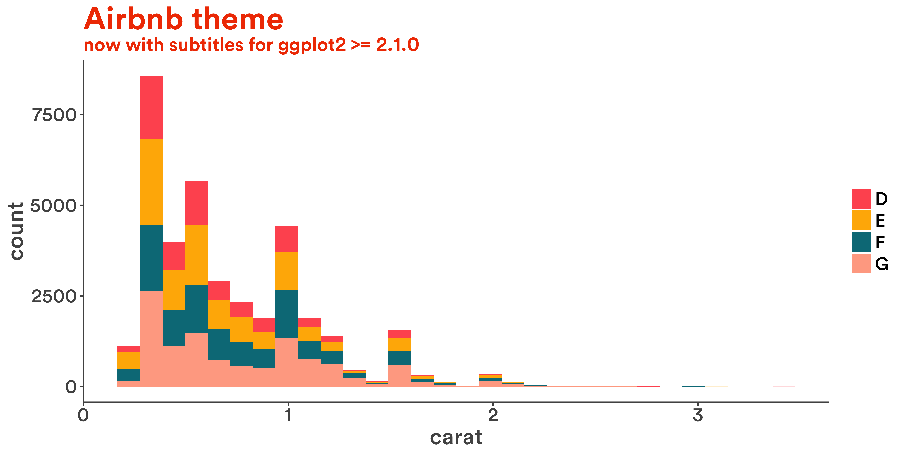
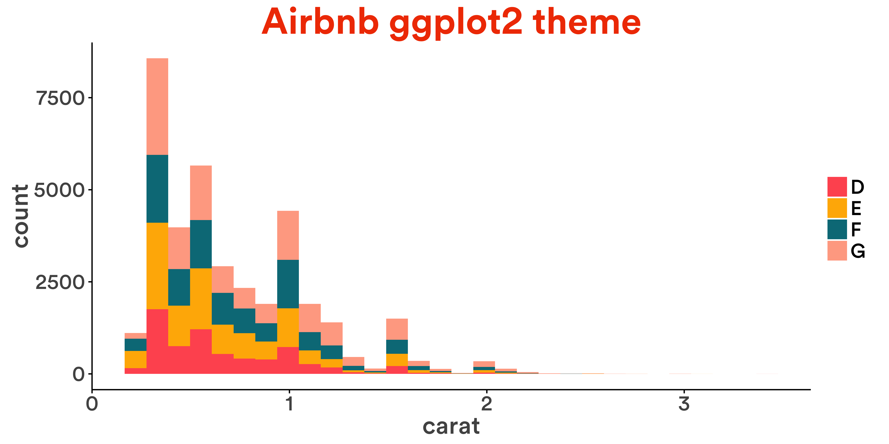
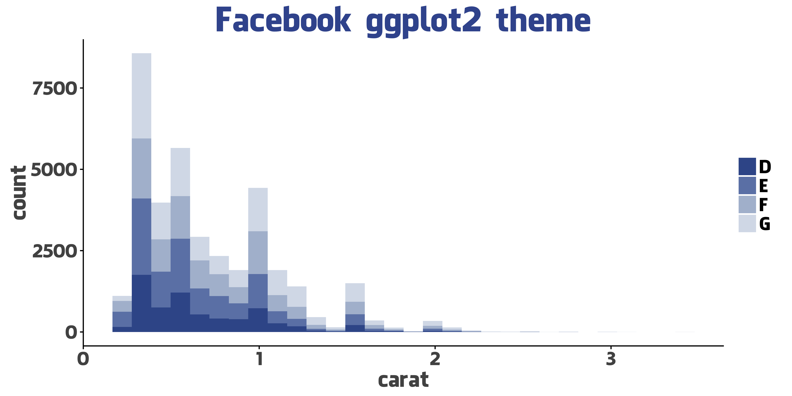
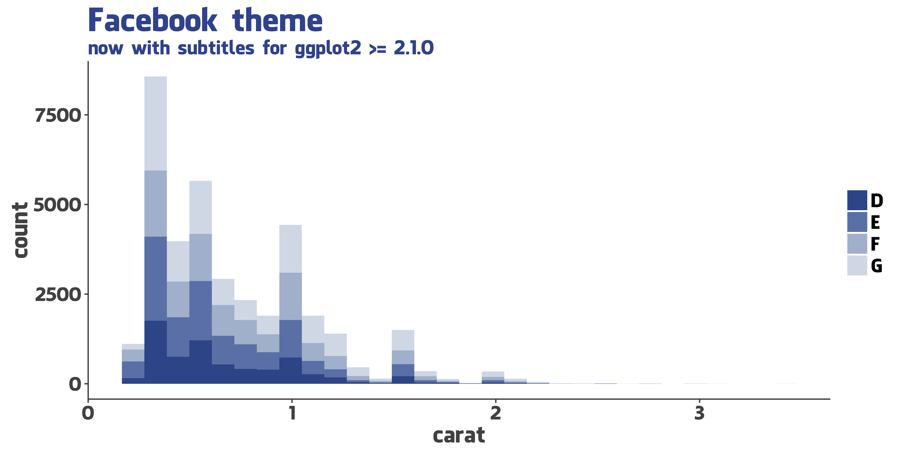
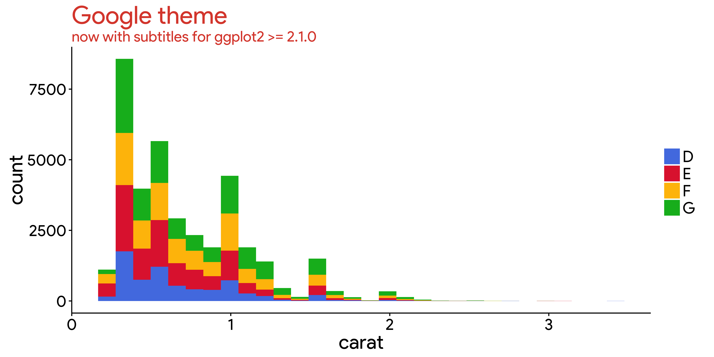

# ggplot2 tech themes, scales, and geoms


### Install ggtech:


```r
devtools::install_github("ricardo-bion/ggtech", 
                          dependencies=TRUE)
```

### Use ggtech


```r
library(ggtech)

d <- qplot(carat, data = diamonds[diamonds$color %in%LETTERS[4:7], ], geom = "histogram", bins=30, fill = color)
```


```r
d + theme_tech(theme="airbnb") + ggtitle("Airbnb ggplot2 theme") + scale_fill_tech(theme="airbnb")
```




```r
d + theme_tech(theme="etsy") + ggtitle("Etsy ggplot2 theme") + scale_fill_tech(theme="etsy")
```




```r
d + theme_tech(theme="facebook") + ggtitle("Facebook ggplot2 theme") + scale_fill_tech(theme="facebook")
```




```r
d + theme_tech(theme="google") + ggtitle("Google ggplot2 theme") + scale_fill_tech(theme="google")
```




```r
d + theme_tech(theme="twitter") + ggtitle("Twitter ggplot2 theme") + scale_fill_tech(theme="twitter")
```




### Install fonts:

You have to install the necessary fonts manually before using `ggtech`. Mofidy the `destfile` if you are using Windows or Unix.


```r
## Facebook 
download.file("http://social-fonts.com/assets/fonts/facebook-letter-faces/facebook-letter-faces.ttf", "/Library/Fonts/facebook-letter-faces.ttf", method="curl")

font_import(pattern = 'facebook-letter-faces.ttf', prompt=FALSE)
font_import(pattern = 'Lucida', prompt=FALSE)


## Google 
download.file("http://social-fonts.com/assets/fonts/catull/catull.ttf", "/Library/Fonts/catull.ttf", method="curl")

font_import(pattern = 'catull.ttf', prompt=FALSE)
font_import(pattern = 'Roboto', prompt=FALSE)


## Airbnb 
download.file("https://dl.dropboxusercontent.com/u/2364714/airbnb_ttf_fonts/Circular%20Air-Medium%203.46.45%20PM.ttf", "/Library/Fonts/Circular Air-Medium 3.46.45 PM.ttf", method="curl")

download.file("https://dl.dropboxusercontent.com/u/2364714/airbnb_ttf_fonts/Circular%20Air-Bold%203.46.45%20PM.ttf", "/Library/Fonts/Circular Air-Bold 3.46.45 PM.ttf", method="curl")

font_import(pattern = 'Circular', prompt=FALSE)


## Etsy 
download.file("https://www.etsy.com/assets/type/Guardian-EgypTT-Text-Regular.ttf", "/Library/Fonts/Guardian-EgypTT-Text-Regular.ttf", method="curl")

font_import(pattern = 'Guardian-EgypTT-Text-Regular.ttf', prompt=FALSE)


## Twitter 
download.file("http://social-fonts.com/assets/fonts/pico-black/pico-black.ttf", "/Library/Fonts/pico-black.ttf", method="curl")

download.file("http://social-fonts.com/assets/fonts/arista-light/arista-light.ttf", "/Library/Fonts/arista-light.ttf", method="curl")

font_import(pattern = 'pico-black.ttf', prompt=FALSE)
font_import(pattern = 'arista-light.ttf', prompt=FALSE)
```
