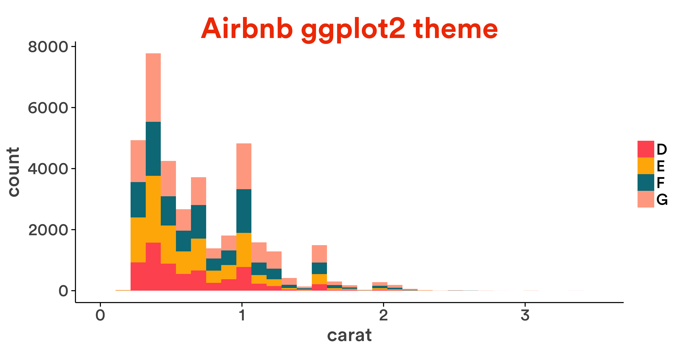

# ggplot2 theme tech


```r
library(ggplot2)
library(extrafont)
```

```
## Registering fonts with R
```

```r
# create plot
d <- qplot(carat, data = diamonds[diamonds$color %in%LETTERS[4:7], ], geom = "histogram", fill = color)
```


```r
if(!file.exists("/Library/Fonts/catull.ttf")) download.file("http://social-fonts.com/assets/fonts/catull/catull.ttf", "/Library/Fonts/catull.ttf", method="curl")

suppressMessages(suppressWarnings(extrafont::font_import(pattern = 'catull.ttf', prompt=FALSE)))


palette_airbnb <- c("#FF5A5F", "#FFB400", "#007A87",  "#FFAA91", "#7B0051")

# etsy theme
theme_airbnb <- function() {
  theme_classic() + 
    theme(text=element_text(size=20, family="Circular Air Medium")) +
    theme(legend.title=element_blank()) + 
    theme(plot.title = element_text(size = 30, colour = "#F14000", family="Circular Air Bold")) + 
    theme(axis.text.x=element_text(color="#535353")) +
    theme(axis.text.y=element_text(color="#535353")) +
    theme(axis.title.x=element_text(color="#535353", vjust=0)) +
    theme(axis.title.y=element_text(color="#535353", vjust=1.25))
}

# ggplot theme and scales
scale_fill_airbnb <- function() scale_fill_manual(values=palette_airbnb)

# boom!
d + ggtitle("Airbnb ggplot2 theme") + theme_airbnb() + scale_fill_airbnb()
```

```
## stat_bin: binwidth defaulted to range/30. Use 'binwidth = x' to adjust this.
```

 


```r
if(!file.exists("/Library/Fonts/facebook-letter-faces.ttf")) download.file("http://social-fonts.com/assets/fonts/facebook-letter-faces/facebook-letter-faces.ttf", "/Library/Fonts/facebook-letter-faces.ttf", method="curl")

suppressMessages(suppressWarnings(extrafont::font_import(pattern = 'facebook-letter-faces.ttf', prompt=FALSE)))

suppressMessages(suppressWarnings(extrafont::font_import(pattern = 'Lucida', prompt=FALSE)))


facebook_palete <- c("#3b5998", "#6d84b4", "#afbdd4", "#d8dfea")

# facebook theme
theme_facebook <- function() {
  theme_classic() + 
    theme(text=element_text(size=20, family="Lucida Grande")) +
    theme(legend.title=element_blank()) + 
    theme(plot.title = element_text(size = 30, colour = "#3D579D", family="Facebook Letter Faces")) + 
    theme(axis.text.x=element_text(color="black")) +
    theme(axis.text.y=element_text(color="black")) +
    theme(axis.title.x=element_text(color="black", vjust=0)) +
    theme(axis.title.y=element_text(color="black", vjust=1.25))
}

scale_fill_facebook <- function() scale_fill_manual(values=facebook_palete)

d + theme_facebook() + ggtitle("Facebook ggplot2 Theme") + scale_fill_facebook()
```

```
## stat_bin: binwidth defaulted to range/30. Use 'binwidth = x' to adjust this.
```

 


```r
if(!file.exists("/Library/Fonts/catull.ttf")) download.file("http://social-fonts.com/assets/fonts/catull/catull.ttf", "/Library/Fonts/catull.ttf", method="curl")

suppressMessages(suppressWarnings(extrafont::font_import(pattern = 'catull.ttf', prompt=FALSE)))
suppressMessages(suppressWarnings(extrafont::font_import(pattern = 'Roboto', prompt=FALSE)))


google_palete <- c("#5380E4", "#E12A3C", "#FFBF03", "#00B723")

# facebook theme
theme_google <- function() {
  theme_classic() + 
    theme(text=element_text(size=20, family="Roboto")) +
    theme(legend.title=element_blank()) + 
    theme(plot.title = element_text(size = 30, colour = "#dd4b39", family="Catull")) + 
    theme(axis.text.x=element_text(color="black")) +
    theme(axis.text.y=element_text(color="black")) +
    theme(axis.title.x=element_text(color="black", vjust=0)) +
    theme(axis.title.y=element_text(color="black", vjust=1.25))
}


scale_fill_google <- function() scale_fill_manual(values=google_palete)

d + theme_google() + ggtitle("Google ggplot theme") + scale_fill_google()
```

```
## stat_bin: binwidth defaulted to range/30. Use 'binwidth = x' to adjust this.
```

 


```r
library(extrafont)
library(ggplot2)

# install fonts
if(!file.exists("/Library/Fonts/Guardian-EgypTT-Text-Regular.ttf")) download.file("https://www.etsy.com/assets/type/Guardian-EgypTT-Text-Regular.ttf", "/Library/Fonts/Guardian-EgypTT-Text-Regular.ttf", method="curl")
suppressMessages(suppressWarnings(extrafont::font_import(pattern = 'Guardian-EgypTT-Text-Regular.ttf', prompt=FALSE)))


palette_etsy <- c("#F14000", "#67B6C3", "#F0DA47", "#EBEBE6", "#D0D0CB")

# etsy theme
theme_etsy <- function() {
  theme_classic() + 
    theme(text=element_text(size=20, family="Guardian EgypTT Regular")) +
    theme(legend.title=element_blank()) + 
    theme(plot.title = element_text(size = 30, colour = "#F14000")) + 
    theme(axis.text.x=element_text(color="#535353")) +
    theme(axis.text.y=element_text(color="#535353")) +
    theme(axis.title.x=element_text(color="#535353", vjust=0)) +
    theme(axis.title.y=element_text(color="#535353", vjust=1.25))
}

# replace default ggplot theme and scales
scale_fill_etsy <- function() scale_fill_manual(values=palette_etsy)
                                     

# create plot
d <- qplot(carat, data = diamonds[diamonds$color %in%LETTERS[4:7], ], geom = "histogram", fill = color)

# boom!
d + ggtitle("Etsy ggplot2 theme") + theme_etsy() + scale_fill_etsy()
```

```
## stat_bin: binwidth defaulted to range/30. Use 'binwidth = x' to adjust this.
```

 


```r
if(!file.exists("/Library/Fonts/pico-black.ttf")) download.file("http://social-fonts.com/assets/fonts/pico-black/pico-black.ttf", "/Library/Fonts/pico-black.ttf", method="curl")
suppressMessages(suppressWarnings(extrafont::font_import(pattern = 'pico-black.ttf', prompt=FALSE)))

if(!file.exists("/Library/Fonts/arista-light.ttf")) download.file("http://social-fonts.com/assets/fonts/arista-light/arista-light.ttf", "/Library/Fonts/arista-light.ttf", method="curl")
suppressMessages(suppressWarnings(extrafont::font_import(pattern = 'arista-light.ttf', prompt=FALSE)))


twitter_palete <- c("#55ACEE", "#292f33", "#8899a6", "#e1e8ed")

# facebook theme
theme_twitter <- function() {
  theme_classic() + 
    theme(text=element_text(size=20, family="[z] Arista Light")) +
    theme(legend.title=element_blank()) + 
    theme(plot.title = element_text(size = 30, colour = "#5380E4", family="PicoBlackAl")) + 
    theme(axis.text.x=element_text(color="black")) +
    theme(axis.text.y=element_text(color="black")) +
    theme(axis.title.x=element_text(color="black", vjust=0)) +
    theme(axis.title.y=element_text(color="black", vjust=1.25))
}


scale_fill_twitter <- function() scale_fill_manual(values=twitter_palete)

d + theme_twitter() + ggtitle("twitter ggplot2 theme") + scale_fill_twitter()
```

```
## stat_bin: binwidth defaulted to range/30. Use 'binwidth = x' to adjust this.
```

 
# ggtech
